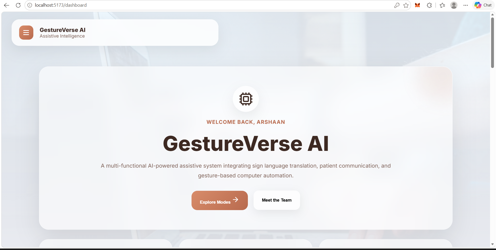
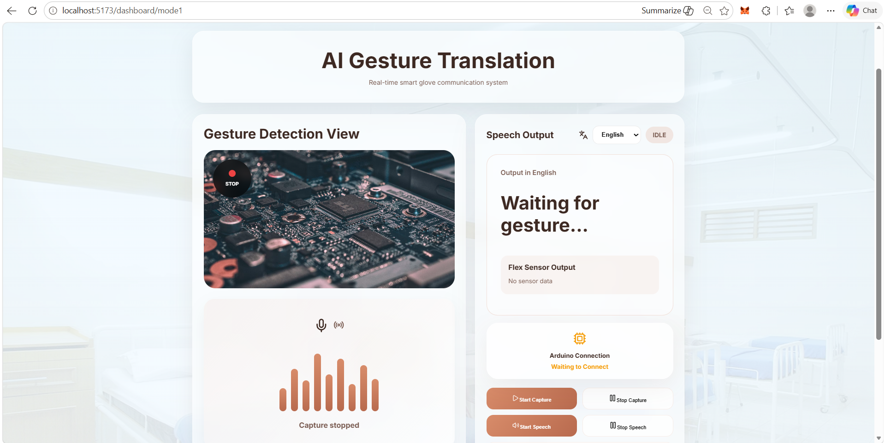
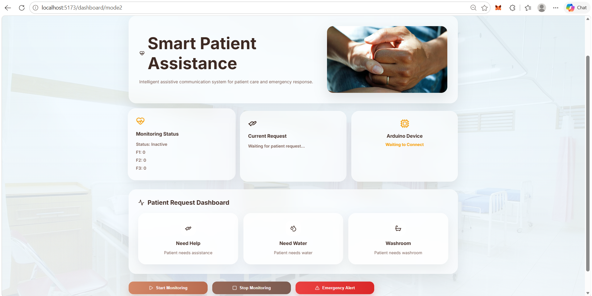
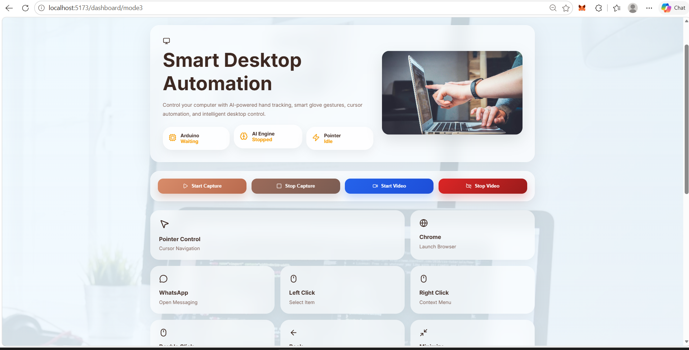
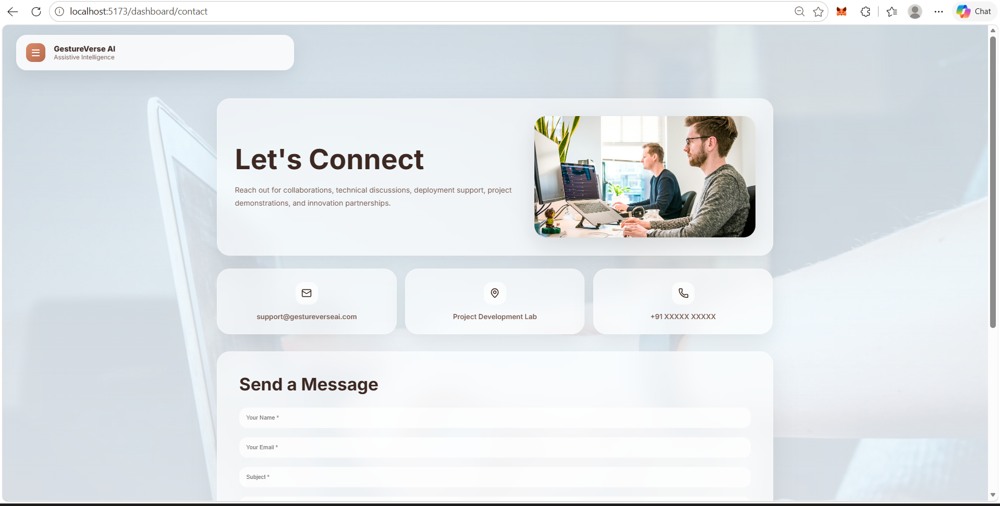
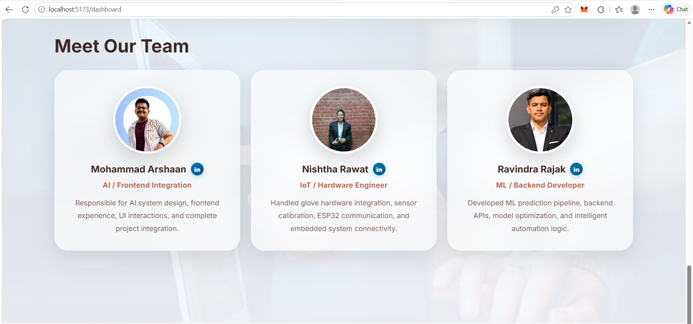

# GestureVerse AI
<p align="center">
  
</p>
### An Intelligent Gesture Recognition System for Communication, Healthcare Assistance and Desktop Automation


---

## Project Overview

GestureVerse AI is an intelligent multimodal gesture recognition platform designed to bridge communication gaps, assist healthcare patients, and enable gesture-based computer interaction. The system combines Artificial Intelligence, Machine Learning, Computer Vision, IoT, and Web Technologies to provide a seamless and user-friendly experience.

The project focuses on empowering individuals with communication difficulties, improving healthcare assistance, and enhancing human-computer interaction through real-time gesture recognition.

---

## Problem Statement

Individuals with speech impairments, physical disabilities, or healthcare limitations often face difficulties in communicating their needs. Traditional systems are either expensive, limited in functionality, or designed for specific use cases.

GestureVerse AI provides a unified solution that enables:

* Smart gesture-based communication
* Patient request recognition
* Emergency healthcare assistance
* Desktop automation through gestures
* Multilingual communication support

---

# Key Features

## Smart Communication Mode

* Real-time gesture recognition
* Gesture-to-text conversion
* Gesture-to-speech conversion
* Multilingual support
* Audio playback functionality
* Live sensor monitoring
* Arduino integration

### Supported Languages

* English
* Hindi
* Arabic
* French
* Spanish
* Urdu

---

## Smart Healthcare Assistance Mode

* Patient request detection
* Healthcare monitoring dashboard
* Emergency recognition system
* Automatic WhatsApp emergency alerts
* Twilio integration
* Live monitoring
* Request tracking

### Supported Requests

* Need Help
* Need Water
* Need Food
* Washroom
* Emergency

---

## Smart Desktop Automation Mode

* Gesture-based cursor control
* Left Click
* Right Click
* Double Click
* Browser Launch
* WhatsApp Launch
* Application Control
* Real-time gesture execution

---

# System Architecture

Gesture Flow:

Hand Gesture

↓

Smart Glove Sensors

↓

Data Acquisition

↓

Machine Learning Model

↓

Gesture Classification

↓

Selected Operational Mode

↓

Output Generation

Communication / Healthcare / Desktop Automation

---

# Technology Stack

## Frontend

* React.js
* Vite
* Framer Motion
* Lucide React
* CSS

## Backend

* Flask
* Python
* OpenCV
* MediaPipe
* PyAutoGUI
* REST APIs

## Database

* MongoDB Atlas

## Communication Services

* Twilio WhatsApp API
* Gmail SMTP

## Hardware

* ESP32 / Arduino
* Flex Sensors
* MPU6050
* Smart Gesture Glove

---

# Project Modules

## Landing Page

Professional project introduction and feature showcase.

## Login & Signup

Secure authentication system connected with MongoDB Atlas.

## Dashboard

Centralized access point to all operational modes.

## Contact Module

Email-based communication system with attachment support.

## Mode 1 – Smart Communication

Converts hand gestures into text and speech while supporting multiple languages.

## Mode 2 – Smart Healthcare Assistance

Recognizes patient requests and sends emergency alerts through WhatsApp.

## Mode 3 – Desktop Automation

Controls desktop operations using gesture recognition and automation commands.

---

# Team Members

## Mohammad Arshaan

**Role:** Full Stack Developer & Project Integration Lead

Responsible for frontend development, backend development, API integration, system architecture, module integration, and overall project coordination.

---

## Nishtha Rawat

**Role:** IoT & Machine Learning Engineer

Responsible for hardware integration, sensor calibration, data preprocessing, machine learning model training, and optimization of gesture recognition performance.

---

## Ravindra Rajak

**Role:** Database & Testing Engineer

Responsible for data collection, database integration, authentication workflow implementation, system testing, validation, and quality assurance.

---

# Project Guide

**Dr. Shyam S Gupta**

Department of Computer Science & Engineering

Amity University Madhya Pradesh

---

# Academic Information

**University:** Amity University Madhya Pradesh

**Academic Year:** 2025–2026

**Project Type:** Major Project

---

# Installation

## Clone Repository

```bash
git clone https://github.com/Md-Arshaan-codes/GestureVerse-AI.git
```

## Frontend Setup

```bash
cd frontend
npm install
npm run dev
```

## Backend Setup

```bash
cd backend
pip install -r requirements.txt
python app.py
```

---

# Future Enhancements

* Deep Learning based gesture recognition
* Mobile application support
* Cloud deployment
* Voice assistant integration
* Advanced healthcare monitoring
* Expanded gesture vocabulary
* Real-time analytics dashboard

---

# Results
# Project Screenshots

## Landing Page

<p align="center">
  
</p>

---

## Login Page

<p align="center">
  
</p>

---

## Dashboard

<p align="center">
  
</p>

---

## Mode 1 – Smart Communication

<p align="center">
  
</p>

---

## Mode 2 – Smart Healthcare Assistance

<p align="center">
  
</p>

---

## Mode 3 – Desktop Automation

<p align="center">
  
</p>

---

## Contact Module

<p align="center">
  
</p>

---

## Development Team

<p align="center">
  
</p>
The system successfully demonstrated:

* Real-time gesture recognition
* Multilingual communication
* Healthcare request detection
* WhatsApp emergency alert generation
* Desktop automation using gestures
* Secure authentication and user management

---

# License

This project is licensed under the MIT License.

---

## GestureVerse AI

**Empowering Communication Through Intelligent Gestures**
